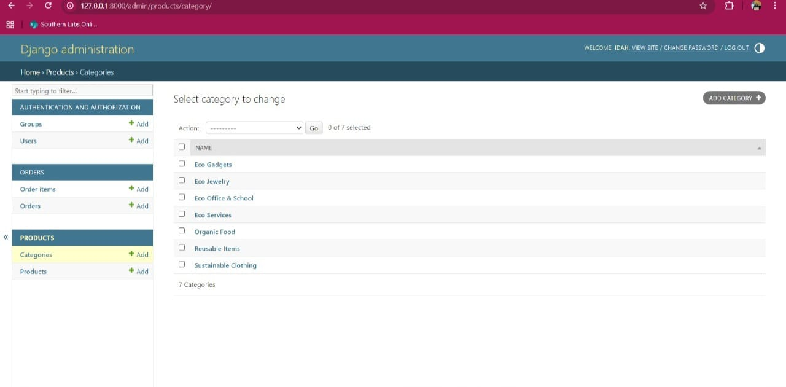
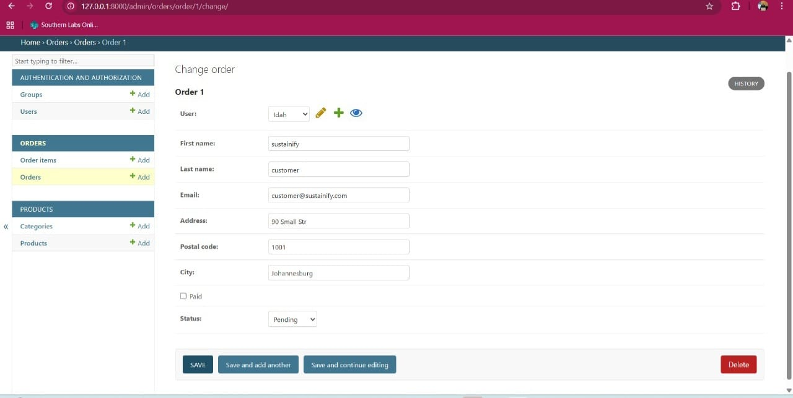

# Sustainify 🌱 - Eco-conscious E-Commerce Platform

**Developer:** Idah Lindiwe Khumalo
**Location:** City of Johannesburg, Gauteng, South Africa
**Contact:** +27671114441 / +27780542966 / +27768338122
**Email:** lindiwekhumalo833@gmail.com
**LinkedIn:** <https://www.linkedin.com/in/idah-khumalo-765778159>
**GitHub:** <https://github.com/Shantralee-58>

## Project Description

Sustainify is an eco-conscious **full-stack** e-commerce **and service** platform built with Django. The platform connects users with verified sustainable products, provides a robust API for order management, and promotes ethical consumption. Sustainify emphasizes sustainability, user empowerment, and ethical consumption by allowing users to:

* Browse products via categories and search.

* Securely place and track orders.

* View contact and store location information.

## 💻 Tech Stack

| Component | Technology | Notes |
| ----- | ----- | ----- |
| **Backend Framework** | **Django 5.x** (Python 3.12) | Provides ORM, routing, and security. |
| **API** | **Django REST Framework (DRF)** | Used for secure, authenticated order placement and product listing. |
| **Database** | **PostgreSQL** (Development) | Default database for local testing. |
| **Frontend** | HTML, CSS (Custom), JavaScript | Focus on clean, responsive UI. |
| **Authentication** | Django's built-in Auth system | Handles user registration, login, and password management. |

## 🚀 Setup Instructions

Follow these steps to set up and run the project locally.

### 1. Prerequisites

Ensure you have **Python 3.8+** and `pip` installed.

### 2. Clone the Repository

git clone https://github.com/Shantralee-58/alx-project-nexus.git
cd alx-project-nexus

### 3. Setup Virtual Environment

Create and activate a virtual environment to isolate project dependencies.

python -m venv venv

Windows
venv\Scripts\activate

macOS/Linux
source venv/bin/activate

### 4. Installation

Install all required Python dependencies from the `requirements.txt` file:

pip install -r requirements.txt

### 5. Database Setup & Initialization

Apply migrations and create the necessary database schema:

python manage.py makemigrations
python manage.py migrate

To access the Django Admin or to test authenticated features, create a superuser:

python manage.py createsuperuser

### 6. Run the Application

Start the local development server:

python manage.py runserver

The application will be accessible in your browser at: **`http://127.0.0.1:8000/`**

## 📂 Project Structure Overview

The project is divided into a core configuration and several distinct Django applications for modularity.

### Root Directory (`alx-project-nexus/`)

| File/Directory | Purpose |
| ----- | ----- |
| **`manage.py`** | Django's command-line utility. |
| **`requirements.txt`** | Lists all project dependencies. |
| **`venv/`** | The Python virtual environment (ignored by .gitignore). |

### Core Applications

| App Directory | Core Functionality |
| ----- | ----- |
| **`project_nexus/`** | Global project settings and URL routing. |
| **`home/`** | Landing page and static content. |
| **`products/`** | Product models, listing, and secure API endpoints. |
| **`orders/`** | Secure API for order creation/history (requires authentication). |
| **`about/`** | 'About Us' and 'Contact Us' pages with email functionality. |
| **`stores/`** | Displaying static store location data. |

### Static & Template Resources

| Directory | Content |
| ----- | ----- |
| **`static/`** | Global CSS (`style.css`), JavaScript, and images. |
| **`templates/`** | Shared base template (`base.html`) and app-specific HTML. |

### Entity Relationship Diagram (ERD)

**The following diagram illustrates the primary database relationships:**

## 🔒 API Documentation

The platform exposes a secure RESTful API using Django Rest Framework. All API interaction requires user authentication.

| Endpoint | Method | Description | Authentication |
| ----- | ----- | ----- | ----- |
| `/api/products/` | GET | List and filter all available products. | Optional |
| `/api/categories/` | GET | List all product categories. | Optional |
| `/api/products/{id}/` | PUT/POST/DELETE | Modify product data. | **Admin Only** |
| `/api/orders/` | POST | **Place a new order.** Requires a JSON payload. | **Required** |
| `/api/orders/` | GET | List the authenticated user's order history. | **Required** |
| `/api/auth/token/login/` | POST | Obtain an authentication token (using Django auth tokens). | N/A |

## 📸 Visual Documentation

### Frontend Pages and Features

| Page / Feature | View |
| :--- | :--- |
| **Homepage & Navigation** |  |
| **User Login Screen** |  |
| **Product Listings** |  |
| **Store Locations** |  |
| **About Us Page** |  |
| **User Orders View** |  |
| **Contact Form** |  |

### Backend and API Views

| View | Screenshot |
| :--- | :--- |
| **Django Admin Interface** |  |
| **Admin: User Management** |  |
| **Admin: Category Management** |  |
| **Admin: Product List View** |  |
| **DRF API Browsable Interface** |  |
| **DRF API: Orders Endpoint** |  |
| **DRF API: Products Endpoint** |  |

***Note:** All documentation images are committed to the appropriate folders (`screenshots/` and `ERD/`) within the project root.*

### Placing an Order (Example POST to `/api/orders/`)

Orders are placed by providing a list of `items` with `product_id` and `quantity`.

{
"items": [
{
"product_id": 1,
"quantity": 2
},
{
"product_id": 5,
"quantity": 1
}
]
}

***Note:** The API view logic automatically valid
